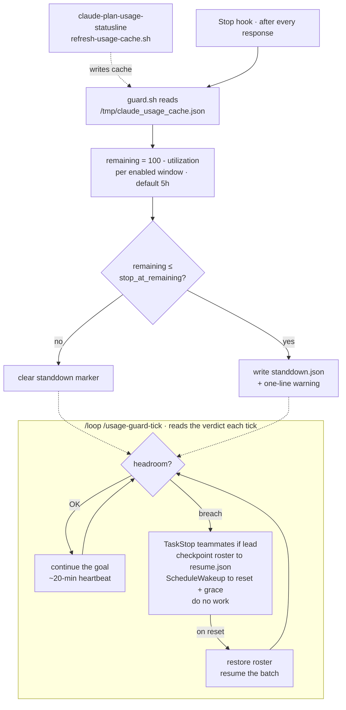

# usage-guard

**A plan-usage guardrail for [Claude Code](https://code.claude.com/docs).** When
your five-hour or weekly headroom runs low, usage-guard makes the session *stand
down* — and, if it is an Agent Teams lead, pauses the whole roster — then wakes
itself one minute after the limit resets and picks the work back up.

It is built entirely from Claude Code's own primitives — a **Stop hook** for
detection and a dynamic **`/loop`** for the stand-down / resume cycle. No daemon,
no OS cron, no background process to babysit.

---

## Why

Long autonomous runs (overnight batches, agent teams, `/loop` jobs) don't fail
gracefully when they hit a rate limit — they stall mid-task, burn the last of a
window on a half-finished edit, or sit idle for hours past a reset that already
happened. The disciplined thing is to **stop early, checkpoint, and resume the
moment the window reopens.** usage-guard encodes exactly that discipline as
configuration, so the run does it on its own.

## How it works



Three small, single-purpose pieces:

| Component | Role |
|-----------|------|
| **`guard.sh`** | Pure *reader* of the usage cache. Computes remaining headroom per window and emits a JSON verdict. Never calls the API. |
| **`stop-hook.sh`** | Runs on the Stop hook. Writes/clears the `standdown.json` marker and surfaces a warning — so even a plain session (no loop) is told when it's low. |
| **`/usage-guard-tick`** | The `/loop` body. Works while there's headroom; on breach, stands the team down and reschedules to the reset. |

## Design notes

A few decisions worth calling out, because they're where the correctness lives:

- **Fail-open, never fail-closed.** A missing or malformed cache yields
  `breach:false`. A monitoring layer that halts your work because it couldn't
  read a temp file is worse than no monitor — usage-guard degrades to a no-op,
  matching how the status line shows `?` rather than a misleading `100%`.
- **Session-first, weekly opt-in.** The five-hour window is the one that governs
  a working session, so it's the default (`"windows": ["5h"]`) — it resets on a
  short horizon, so stand-downs are brief and the resume lands the same day. The
  seven-day window is a separate concern with a days-long reset; watch it only if
  you deliberately want to stop on the weekly cap (`["5h", "7d"]`). When more than
  one window is breached, the wake targets the *later* reset — you only regain
  headroom once the slowest breached window reopens.
- **Clamp-aware rescheduling.** `ScheduleWakeup` caps a delay at one hour, but a
  reset can be further out. In stand-down the loop hops in ≤1h steps, re-checking
  and doing no work each time, until the window has actually reset — arbitrarily
  long waits with periodic quiet re-checks, no drift.
- **One cache producer.** Detection reads the exact cache the status line already
  maintains; usage-guard never duplicates the OAuth call. Two Stop hooks sharing
  one debounced producer, not two pollers racing the API.

## Dependency

usage-guard consumes `/tmp/claude_usage_cache.json`, which is produced by
[claude-plan-usage-statusline](https://github.com/romacv/claude-plan-usage-statusline)'s
`refresh-usage-cache.sh`. If it's already installed, usage-guard reuses it; if
not, the installer bootstraps just that one script and its Stop hook. Installing
the full status line is recommended — it renders the same headroom, live, in your
terminal.

**Requirements:** macOS · Ruby (system Ruby is fine) · Claude Code, authenticated.

## Install

```sh
curl -fsSL https://raw.githubusercontent.com/romacv/claude-usage-guard/main/install.sh | sh
```

Restart Claude Code so the Stop hook loads.

## Use

Start your work under the guardrail loop, passing what to keep doing:

```
/loop /usage-guard-tick finish the DEV-1976 refactor and keep the tests green
```

While there's headroom it advances the goal on a ~20-minute heartbeat. When
headroom hits the threshold it stands down — pausing any teammates and
checkpointing them — then wakes one minute after the reset and resumes from where
it left off.

### With Agent Teams

Run the loop in the **lead** session. On breach the lead `TaskStop`s every
teammate and records the roster, the task ledger, and the goal to `resume.json`,
reconciling the ledger so no task is left mid-flight. After the reset it
re-sends each teammate its pending task (or re-spawns a dead pane) and resumes
the batch. Plain single sessions get the same stand-down without the roster step.

## Configure

`~/.claude/usage-guard/config.json`:

| Key | Default | Meaning |
|-----|---------|---------|
| `stop_at_remaining` | `10` | Stand down when remaining headroom (%) falls to this or below. |
| `resume_grace_seconds` | `60` | Wake this many seconds after the reset. |
| `heartbeat_seconds` | `1200` | Cadence between work ticks while healthy. |
| `windows` | `["5h"]` | Which limit windows to watch. Add `"7d"` to also stop on the weekly cap. |

Threshold can also be overridden per-run: `USAGE_GUARD_STOP_AT=80`.

**Trying it out.** To force a breach on demand, raise the threshold above your
current remaining and watch only the near-term window, so the wake target stays
hours away rather than days:

```sh
printf '{"stop_at_remaining":65,"windows":["5h"]}' > ~/.claude/usage-guard/config.json
~/.claude/usage-guard/guard.sh          # inspect the verdict
```

For production, watch the 5h window with a tight `stop_at_remaining` (e.g. `10`).

## Uninstall

```sh
curl -fsSL https://raw.githubusercontent.com/romacv/claude-usage-guard/main/uninstall.sh | sh
```

Removes usage-guard and its Stop hook; leaves the shared cache producer in place.

## License

MIT © Roman Resenchuk
