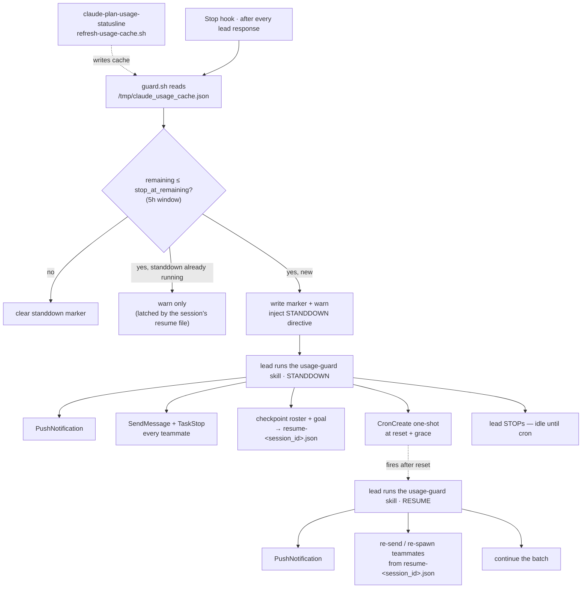

# usage-guard

**A plan-usage guardrail for [Claude Code](https://code.claude.com/docs).** When
your five-hour headroom runs low, usage-guard stands the **lead and every Agent
Teams teammate** down, sends a notification, and schedules an automatic resume one
minute after the limit resets — then wakes and picks the batch back up.

Built entirely from Claude Code's own primitives — a **Stop hook** for detection,
a **skill** for the stand-down / resume protocol, and a one-shot **cron** for the
timed resume. No daemon, no OS scheduler, no background process to babysit.

---

## Why

Long autonomous runs — overnight batches, agent teams — don't fail gracefully at a
rate limit. They stall mid-task, burn the last of a window on a half-finished
edit, or sit idle for hours past a reset that already happened. The disciplined
thing is to **stop early, checkpoint, notify, and resume the moment the window
reopens.** usage-guard encodes that discipline so the run does it on its own.

## How it works



Subagents (one-shot `Agent`-tool runs) are left alone — they finish and return.
Only the lead and teammates stand down.

| Component | Role |
|-----------|------|
| **`guard.sh`** | Pure *reader* of the usage cache. Emits a JSON verdict (remaining, reset, wake time). Never calls the API. |
| **`stop-hook.sh`** | On the Stop hook: writes/clears the session-scoped `standdown-<session_id>.json` marker, warns, and — once per standdown — injects the directive that makes the lead run the skill. |
| **`usage-guard` skill** | The `STANDDOWN`, `RESUME`, and `CANCEL` protocols the lead executes: notify, stop/rehydrate teammates, checkpoint, schedule and honor the resume cron, or abort a pending stand-down. |
| **`cancel.sh`** | On-request cancel: clears a session's marker + checkpoint and mutes it, so a pending resume becomes a no-op and the session stops standing down. |

## Design notes

Where the correctness lives:

- **Fail-open, never fail-closed.** A missing, malformed, or rate-limited cache
  yields `breach:false` with a `reason`, and the hook leaves any active pause
  untouched. A monitor that halts your work because it couldn't read a temp file
  is worse than no monitor.
- **Fire once per standdown.** The injected directive is latched by the session's
  `resume-<session_id>.json`: the hook drives the skill only when a standdown isn't
  already in progress, so a breach that persists across responses never busy-loops
  the lead.
- **Session-scoped state.** Every marker and roster file is keyed by `session_id`
  (`standdown-<id>.json`, `resume-<id>.json`), so concurrent Claude Code sessions
  never share — or clobber — each other's checkpoint. Only the usage cache and
  `config.json` are global, because they are account-wide by nature.
- **Self-resume without an OS scheduler.** `additionalContext` on the Stop hook
  continues the conversation exactly once, giving the lead a turn to stand down
  and schedule a one-shot `CronCreate` for the reset. The lead then goes idle
  until that single cron fires — no `/loop` to keep alive, nothing written into
  the OS.
- **One cache producer.** Detection reads the exact cache the status line already
  maintains; usage-guard never duplicates the OAuth call.

## Dependency

usage-guard consumes `/tmp/claude_usage_cache.json`, produced by
[claude-plan-usage-statusline](https://github.com/romacv/claude-plan-usage-statusline)'s
`refresh-usage-cache.sh`. If it's installed, usage-guard reuses it; if not, the
installer bootstraps just that one script and its Stop hook. The status line also
renders the pause live: `⏸paused by 5h limit, resume 20:01`.

**Requirements:** macOS · Ruby (system Ruby is fine) · Claude Code, authenticated.

## Install

```sh
curl -fsSL https://raw.githubusercontent.com/romacv/claude-usage-guard/main/install.sh | sh
```

Restart Claude Code so the Stop hook and skill load.

## Use

Nothing to invoke. Run your work — including an Agent Teams batch — as usual. The
Stop hook watches headroom after every response; when it crosses the threshold the
lead automatically notifies, stands itself and every teammate down, checkpoints,
and schedules the resume. One minute after the 5h limit resets the cron fires, the
lead re-sends each teammate its task (or re-spawns a dead pane), and the batch
continues.

The lead's session must stay open for the resume cron to fire (it is session-only,
nothing is written to the OS).

## Cancel a pending stand-down

Changed your mind mid-pause? Cancel it:

```sh
~/.claude/usage-guard/cancel.sh            # list sessions currently standing down
~/.claude/usage-guard/cancel.sh <id>       # cancel that session
~/.claude/usage-guard/cancel.sh --all      # cancel every standing-down session
```

Cancel clears the session's marker + checkpoint (the status line pause disappears)
and mutes the session, so it won't stand down again while still below the
threshold. Any resume already scheduled becomes a no-op — with the checkpoint
gone, the `RESUME` protocol aborts when the cron fires. Re-arm the session later
by removing its mute: `rm ~/.claude/usage-guard/off-<id>`.

The resume itself is a session-only cron; if you want it gone immediately rather
than firing into a no-op, ask the lead to `CronDelete` it.

## Configure

`~/.claude/usage-guard/config.json`:

| Key | Default | Meaning |
|-----|---------|---------|
| `stop_at_remaining` | `10` | Stand down when remaining headroom (%) falls to this or below. |
| `resume_grace_seconds` | `60` | Resume this many seconds after the reset. |
| `windows` | `["5h"]` | Which limit windows to watch. Add `"7d"` to also stop on the weekly cap. |

Per-run threshold override: `USAGE_GUARD_STOP_AT=80`.

**Exempt a single window.** `config.json` is global, so to keep one session
working while the others stand down, drop an empty `off-<session_id>` file in
`~/.claude/usage-guard/` — that session's Stop hook then does nothing. Remove the
file to re-arm it.

**Trying it out.** Force a breach on demand by raising the threshold above your
current remaining:

```sh
USAGE_GUARD_STOP_AT=90 ~/.claude/usage-guard/guard.sh   # inspect the verdict
```

For production, keep a tight `stop_at_remaining` (e.g. `10`).

## Uninstall

```sh
curl -fsSL https://raw.githubusercontent.com/romacv/claude-usage-guard/main/uninstall.sh | sh
```

Removes usage-guard, its skill, and its Stop hook; leaves the shared cache
producer in place.

## License

MIT © Roman Resenchuk
