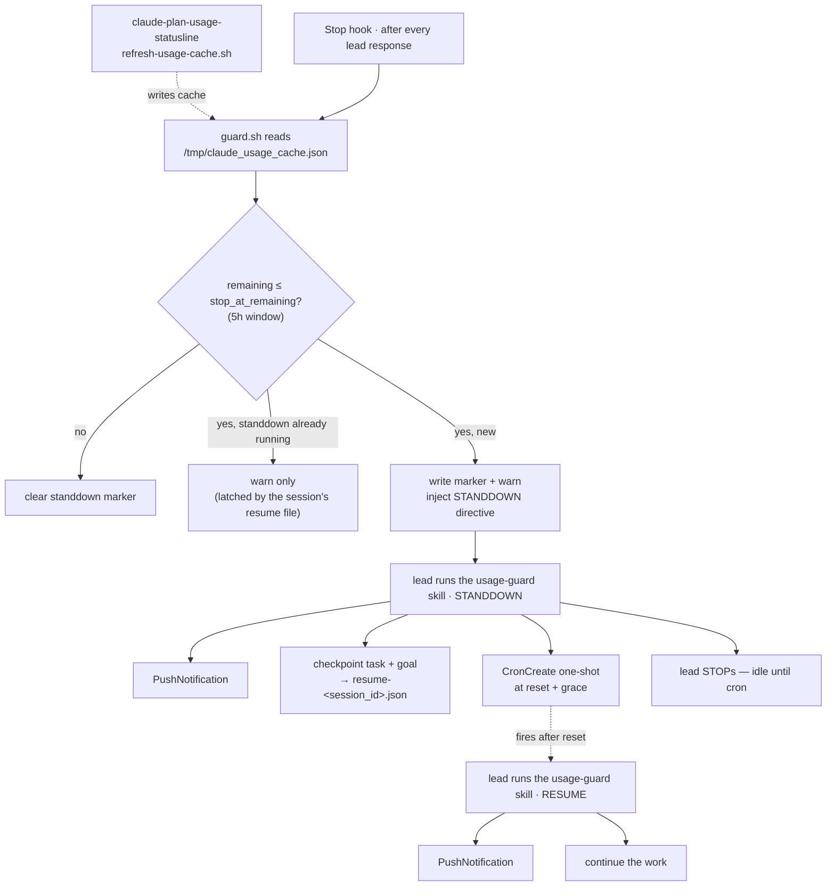

# usage-guard

**A plan-usage guardrail for [Claude Code](https://code.claude.com/docs).** When
your five-hour headroom runs low, usage-guard stands the **lead session** down,
sends a notification, and schedules an automatic resume one minute after the
limit resets — then wakes and picks the work back up.

Built entirely from Claude Code's own primitives — a **Stop hook** for detection,
a **skill** for the stand-down / resume protocol, and a one-shot **cron** for the
timed resume. No daemon, no OS scheduler, no background process to babysit.

---

## Why

Long autonomous runs — overnight batches, agent teams — don't fail gracefully at a
rate limit. They stall mid-task, burn the last of a window on a half-finished
edit, or sit idle for hours past a reset that already happened. The disciplined
thing is to **stop early, checkpoint, notify, and resume the moment the window
reopens.** usage-guard encodes that discipline so the run does it on its own.

## How it works


```mermaid
flowchart TD
    P["claude-plan-usage-statusline<br/>refresh-usage-cache.sh"] -. writes cache .-> B
    A["Stop hook · after every lead response"] --> B["guard.sh reads<br/>/tmp/claude_usage_cache.json"]
    B --> C{"remaining ≤ stop_at_remaining?<br/>(5h window)"}
    C -->|no| E["clear standdown marker"]
    C -->|yes, standdown already running| W["warn only<br/>(latched by the session's resume file)"]
    C -->|yes, new| F["write marker + warn<br/>inject STANDDOWN directive"]

    F --> G["lead runs the usage-guard skill · STANDDOWN"]
    G --> N1["PushNotification"]
    G --> R["checkpoint task + goal<br/>→ resume-&lt;session_id&gt;.json"]
    G --> K["CronCreate one-shot<br/>at reset + grace"]
    G --> S["lead STOPs — idle until cron"]

    K -.fires after reset.-> Z["lead runs the usage-guard skill · RESUME"]
    Z --> N2["PushNotification"]
    Z --> CO["continue the work"]
```

Subagents already running are left alone — they finish and return. Only the
lead stands down. New subagents are a different story: a `PreToolUse` gate on
the `Agent` tool refuses to spawn one while the same breach that would stand
the lead down is active, so a dispatch fired moments before the limit doesn't
keep spending from a lead that's already stood down — and can't be killed
mid-task by the limit itself.

| Component | Role |
|-----------|------|
| **`guard.sh`** | Pure *reader* of the usage cache. Emits a JSON verdict (remaining, reset, wake time). Never calls the API. |
| **`stop-hook.sh`** | On the Stop hook: writes/clears the session-scoped `standdown-<session_id>.json` marker, warns, and — once per standdown — injects the directive that makes the lead run the skill. |
| **`pretool-hook.sh`** | On `PreToolUse` for the `Agent` tool: re-uses `guard.sh`'s verdict and denies the spawn on breach, with a reason the model won't retry in a loop. Allows on any other reading, including a failure to read the cache. |
| **`usage-guard` skill** | The `STANDDOWN`, `RESUME`, and `CANCEL` protocols the lead executes: notify, checkpoint, schedule and honor the resume cron, or abort a pending stand-down. |
| **`cancel.sh`** | On-request cancel: clears a session's marker + checkpoint so a pending resume becomes a no-op. There is no mute — the guard stays armed, so cancel is durable only once the breach has passed. Surfaces the checkpoint's `resume_cron_id` so the owning window can `CronDelete` the job precisely. |

## Design notes

Where the correctness lives:

- **Fail-open, never fail-closed.** A missing, malformed, rate-limited, or
  stale cache yields `breach:false` with a `reason` (`no_cache`, `bad_cache`,
  `no_data`, or `stale_cache` when the cache is older than `max_age_seconds`),
  and the Stop hook leaves any active pause untouched. The spawn gate goes
  further: anything that stops it from
  reading a clean verdict — `guard.sh` missing, Ruby absent, unparseable
  output — also means allow. A monitor that halts your work because it
  couldn't read a temp file is worse than no monitor.
- **Fire once per standdown.** The injected directive is latched by the session's
  `resume-<session_id>.json`: the hook drives the skill only when a standdown isn't
  already in progress, so a breach that persists across responses never busy-loops
  the lead.
- **Session-scoped state.** Every marker and roster file is keyed by `session_id`
  (`standdown-<id>.json`, `resume-<id>.json`), so concurrent Claude Code sessions
  never share — or clobber — each other's checkpoint. Only the usage cache and
  `config.json` are global, because they are account-wide by nature.
- **Self-resume without an OS scheduler.** `additionalContext` on the Stop hook
  continues the conversation exactly once, giving the lead a turn to stand down
  and schedule a one-shot `CronCreate` for the reset. The lead then goes idle
  until that single cron fires — no `/loop` to keep alive, nothing written into
  the OS.
- **Deterministic teardown.** `STANDDOWN` records the resume cron's id in the
  checkpoint (`resume_cron_id`), so cancelling deletes the exact job instead of
  guessing or depending on the id surviving a context compaction. The one hard
  limit is the platform's: session-only crons can be removed only from the window
  that created them.
- **One cache producer.** Detection reads the exact cache the status line already
  maintains; usage-guard never duplicates the OAuth call.
- **Deferring costs you.** Ignore the warning and keep prompting past the limit and
  the push applies +5 min to the scheduled resume — but only per genuinely ignored
  warning, at most once per 5 min of real wall-clock time, and never to a
  hook-forced continuation (e.g. a `/goal` busy-loop). You are burning quota that
  delays the real reset, so the estimate moves with it, without a machine-driven
  loop outrunning real time. Frozen once you stand down.
- **The pause badge self-expires.** The status line hides `⏸paused …` once the wake
  time is safely past even if no resume ran, and the hook reaps orphaned markers an
  hour past their wake — a stood-down idle session can't freeze a stale time forever.

## Dependency

usage-guard consumes `/tmp/claude_usage_cache.json`, produced by
[claude-plan-usage-statusline](https://github.com/romacv/claude-plan-usage-statusline) --
written on every render from Claude Code's own stdin data when available, and
by `refresh-usage-cache.sh`'s OAuth API fallback otherwise. If it's installed,
usage-guard reuses it; if not, the installer bootstraps just the fallback
script and its Stop hook. The status line also renders the pause live:
`⏸paused to 20:01`.

**Requirements:** macOS · Ruby (system Ruby is fine) · Claude Code, authenticated.

## Install

```sh
curl -fsSL https://raw.githubusercontent.com/romacv/claude-usage-guard/main/install.sh | sh
```

Restart Claude Code so the Stop hook, spawn gate, and skill load.

## Use

Nothing to invoke. Run your work as usual. The Stop hook watches headroom after
every response; when it crosses the threshold the lead automatically notifies,
stands itself down, checkpoints, and schedules the resume. One minute after the
5h limit resets the cron fires and the lead continues from where it stood down.

The lead's session must stay open for the resume cron to fire (it is session-only,
nothing is written to the OS).

## Anti-patterns

Don't use `/goal` to hold a session until a fixed time. `/goal` is
condition-based — it re-evaluates on every Stop-hook fire, so "wait until HH:MM"
busy-loops the hook and burns quota every cycle. For a time-based hold, schedule a
one-shot session cron with `CronCreate` (the same primitive usage-guard's own
resume uses) and stay idle. Separately: `/goal clear` may surface one stale
"Stop hook error" quoting the just-cleared condition afterward — that is Claude
Code's own `/goal` internals, not usage-guard (its Stop hook always exits 0 and
never reads or quotes goal state), and is harmless.

## Cancel a pending stand-down

Changed your mind mid-pause? Cancel it:

```sh
~/.claude/usage-guard/cancel.sh            # list sessions currently standing down
~/.claude/usage-guard/cancel.sh <id>       # cancel that session
~/.claude/usage-guard/cancel.sh --all      # cancel every standing-down session
```

Cancel clears the session's marker + checkpoint (the status line pause disappears).
Any resume already scheduled becomes a no-op — with the checkpoint gone, the
`RESUME` protocol aborts when the cron fires. There is no mute: the guard stays
armed, so if the session is still below the threshold the next Stop hook stands it
down again. Cancel is durable only once the breach has actually passed.

The resume itself is a session-only cron. `cancel.sh` prints its id (the
`STANDDOWN` protocol records it in the checkpoint as `resume_cron_id`) so you can
`CronDelete` it precisely — but only from the window that scheduled it, since
session-only crons can't be removed from another window. If you'd rather not
bother, leave it: with the checkpoint gone it just fires into a no-op.

## Configure

`~/.claude/usage-guard/config.json`:

| Key | Default | Meaning |
|-----|---------|---------|
| `stop_at_remaining` | `10` | Stand down when remaining headroom (%) falls to this or below. |
| `resume_grace_seconds` | `60` | Resume this many seconds after the reset. |
| `windows` | `["5h"]` | Which limit windows to watch. Add `"7d"` to also stop on the weekly cap. |
| `max_age_seconds` | `1800` | Reject the cache as `stale_cache` once it's older than this. |

Per-run overrides: `USAGE_GUARD_STOP_AT=80`, `USAGE_GUARD_MAX_AGE=3600`.

**Trying it out.** Force a breach on demand by raising the threshold above your
current remaining:

```sh
USAGE_GUARD_STOP_AT=90 ~/.claude/usage-guard/guard.sh   # inspect the verdict
```

For production, keep a tight `stop_at_remaining` (e.g. `10`).

## Uninstall

```sh
curl -fsSL https://raw.githubusercontent.com/romacv/claude-usage-guard/main/uninstall.sh | sh
```

Removes usage-guard, its skill, its Stop hook, and its spawn gate; leaves the
shared cache producer in place.

## License

MIT © Roman Resenchuk
